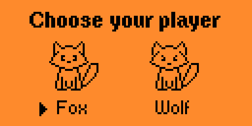
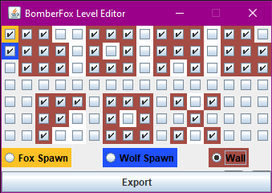
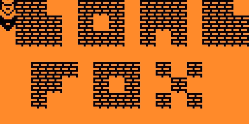
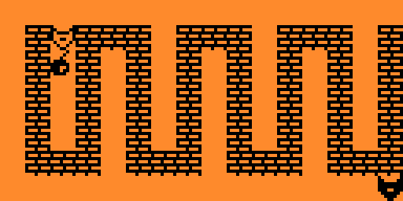
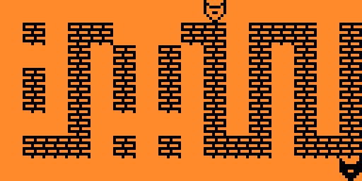

# BomberFox  
Bomberman for the FlipperZero utilising the SubGHz radio for multiplayer functionality with other nearby flipper devices!

For more information about the SubGHz protocol, please see [protocol.md](protocol.md)

## How to play
- Select a character, Wolf Or Fox!
- Fox is Player 1 and chooses the level. Ensure Player 2 has selected "Wolf" before Fox starts the game.
- Move with directional D-Pad
- Place Bomb with Center Button
- Broken walls may reveal hidden power-ups! Either extra bombs, or increased explosion distance.
- Exit Game by holding the return button

To play multiplayer locally with another person, make sure you select different characters!

## Project Status
This project is in active development. We're currently working towards an initial release.

## Level Editor
A basic Java Applet for creating levels for BomberFox
[BomberFoxLevelEditor](https://github.com/BeanGirlThing/BomberFoxLevelEditor)

## In Game Screenshots!

## Special Thanks! 
This project would not be possible without these great people!
- [FlipperZero](https://github.com/flipperdevices)
- [UFBT](https://github.com/flipperdevices/flipperzero-ufbt)
- Various other open source applications which were used as reference!
